# opponent.md: The Scripted Team

This document describes how the rule-based team plays. The code is `ScriptedTeam` in `football_adapt/opponent/controller.py`. It is the opponent (red, team 1) in every experiment, and it can drive our side as well (`FootballEnv(cfg, scripted_ours=True)`), which is how the Phase 0 checks and the pictures below are made. Read `game.md` first: the scripted team plays under the same rules and physics as our team.

**In one paragraph.** Each player has a home position that comes from the team's formation and slides between an attacking and a defending shape with possession. Without the ball the team defends zones: the nearest player presses, a second can join, one covers, and the rest shift toward the ball. With the ball the carrier shoots, passes forward, carries, or lays the ball off under pressure, using only what that player can see, while teammates make runs and offer passes. A play style (normal, aggressive or defensive) changes how high the team stands and how it presses. The team can switch formation during a match, and one player can be a playmaker with unlimited vision.

**Reading the pictures.** Every picture is a real moment from a scripted match, with the players' decisions drawn on top. Red circles are the team being explained, and red attacks to the **left**. Blue triangles are the other side (scripted too, normal style). The letter under a player is the role: D defender, M midfielder, F forward. Section 16 says how the pictures are made.

| Section | Topic |
|---|---|
| 1–3 | Purpose, what the players know, how a player decides |
| 4 | Team shape: home positions, attacking and defending shapes |
| 5 | Defending: pressing, cover, counter-press, cutting passing lanes |
| 6 | The player on the ball: shooting, passing, carrying, patience |
| 7 | Players off the ball: runs, offering a pass, counter-attack |
| 8 | Play styles: normal, aggressive, defensive |
| 9–10 | Formations and switching; the playmaker |
| 11–16 | Config reference, code reference, logging, Phase 0 checks, common mistakes, the pictures |

All numbers are the defaults in `football_adapt/configs/default.yaml`, which is the source of truth. Unless a section says otherwise they are the **normal** style; Section 8 lists what the other styles change.

---

## 1. Purpose and Design Constraints

The opponent is a **fixed, hand-written team that does not learn**. It must satisfy:

| Requirement | Why |
|---|---|
| Holds its formation (players near anchors) | Q2 requires the formation to be readable from player positions |
| Vision-limited (each player sees only within `R_VISION`) | Prevents information advantage that would break Q1/Q2 |
| Can switch formation mid-match (3 modes) | Q2 |
| One player can be a playmaker (infinite vision) | Q3 |
| Worthwhile opponent (random policy loses clearly) | Learning results must be meaningful |
| Reproducible (same seed → same match) | Paired evaluation and debugging |
| Same physics as our team (no teleporting) | Fairness |

**Must NOT be:** man-marking (pulls players from anchors, hides formation), learning, or omniscient (except the playmaker).

One deliberate exception to the man-marking rule: the aggressive play style cuts passing lanes (Section 5.5). That places players by where the other team's players stand, within a fixed distance of home. It is off in the normal and defensive styles.

---

## 2. Inputs and Outputs

- **Input to each player:** the `Obs` dataclass built by `football.observation.build_observation()`. It is the **same function** used for our players, called with that player's own vision radius (25 m).
- **Output:** one `Action` per player per step. The scripted team uses three macro actions that the learner does not have: `MOVE_TO` (walk toward a point), `THROUGH` (a pass to a point instead of to a teammate's feet, Section 6.4) and `CLEAR` (a long ball upfield to nobody, Section 6.3 rule 5).
- **Team frame:** the environment mirrors coordinates before a team receives them. The controller code runs as if attacking toward +x, for both teams.
- **Control rating:** the scripted team always uses structure level `zeta = 2`, so a player far from the anchor tackles, passes and shoots worse (`game.md`, Section 5).

**What a player knows.** A player decides from that player's own `Obs`: the ball and the opponents inside the vision radius, and all four teammates. Three things are shared across the team, as if called out between players:

| Shared | Used for |
|---|---|
| Who has possession | Everything (it is in every `Obs` anyway) |
| Where the ball is, if at least one teammate sees it | The ball-side slide of the block (4.1) and cutting passing lanes (5.5) |
| Who is nearest to the ball among those who see it | Choosing one presser (5.1) |

`Obs.incoming` tells one player where a pass in flight will land: the intended receiver, or the defender the game has picked to intercept it.

**Critical rule:** the controller is called with the `obs_by_player` dict only, never with the full environment state.

---

## 3. How a Player Decides

```
ScriptedTeam
 ├─ FormationManager     which formation the team is in (Section 9)
 ├─ team step            timers and roles, once per step
 └─ player step          for each player, the first rule that applies
```

**Team step.** `act()` first updates the state the whole team shares:

| Team state | Starts when | Lasts | Used in |
|---|---|---|---|
| Counter-press timer | Possession goes from us to them | 10 steps (`moves.counter_press.steps`) | 5.4 |
| Counter-attack timer | Possession goes from them to us | 15 steps (`moves.counter.steps`) | 7.7 |
| Mover (the player who just passed) | A player passes | 10 steps (`moves.pass_move.steps`) | 7.1 |
| Possession length | Counts every step we keep the ball | Reset when they hold it | 6.5 (patience) |
| Roles for this step | Every step | One step | Presser, second presser, cover, lane blockers (Section 5) |

A change of possession is only counted between "we hold it" and "they hold it". A loose ball or a pass in flight is not a change.

**Player step.** Each player then takes the first rule that applies:

| # | Situation | What the player does |
|---|---|---|
| 1 | A pass in flight will land with me (`Obs.incoming`) | Run to the landing point |
| 2 | The team has just changed formation and I am not at my new home (and I do not have the ball) | Walk to it (Section 9) |
| 3 | I have the ball | Section 6 |
| 4 | A teammate has the ball | Section 7 |
| 5 | The ball is loose or in flight | The nearest player who sees it goes to it. If it is our own pass, the others keep supporting (Section 7). Otherwise they defend (Section 5) |
| 6 | The other team has the ball | Section 5 |

With `randomness.eps_opp` above 0 (default 0), a player instead takes a random valid action with that probability.

---

## 4. Team Shape

### 4.1 Home Positions

Every player has an **anchor**: the place the formation gives that slot (`game.md`, Section 4). The environment owns the anchors, so the control rating and `Obs.anchor` follow them.

The scripted player's **home position** is the anchor plus one adjustment: when the other team has the ball, the whole team slides sideways toward the side the ball is on, by up to 3 m (`width.slide`), moving 0.3 m per step.

Two older adjustments still exist as settings but are switched off (set to 0), because the shapes below do the same job with a bigger range: `block` (push the whole team up or back) and `width.attack` / `width.defend` (stretch or squeeze the team's width).

### 4.2 Attacking and Defending Shapes

Every formation has two extra shapes, set in `formations.phases`. In each shape every line (D, M, F) has its own depth, and the team's width is scaled around the centre line.

| Normal style | Defenders | Midfielders | Forwards | Width |
|---|---|---|---|---|
| Attacking shape (we have the ball) | 42 m | 76 m | 85 m | 115% |
| Base shape (kickoff) | 25 m | 50 m | 75 m | 100% |
| Defending shape (they have the ball) | 15 m | 30 m | 50 m | 80% |

Depths are metres from the team's own goal on the 100 m pitch.

How it moves:

- The environment keeps a `phase` per team between -1 (defending shape) and +1 (attacking shape). Each step it moves by `rate` (0.05) toward +1 while the team holds the ball and toward -1 while the other team holds it. So a full swing from one shape to the other takes 40 steps.
- The phase is kept while the ball is loose or in flight, and it is reset to 0 (base shape) at every kickoff.
- The anchors are blended between the base shape and the attacking or defending shape by the phase. The players then walk toward them at normal speed; nobody is moved.
- This is a rule of the game, not only of the scripted team: it applies to both sides, including our learned team's anchors.
- `formations.phases.enabled: false` gives fixed anchors.

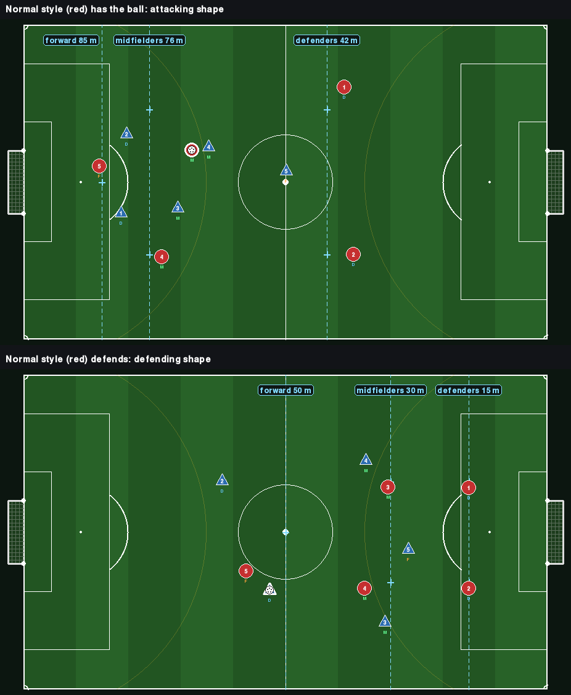

*Normal style. Top: red has the ball and stands in its attacking shape. Bottom: blue has the ball and red stands in its defending shape. The crosses are red's home positions, and each dashed line shows how far that line is from red's own goal (on the right).*

---

## 5. Defending

Defending is **zonal**: players guard the area around their home position and only some of them leave it.

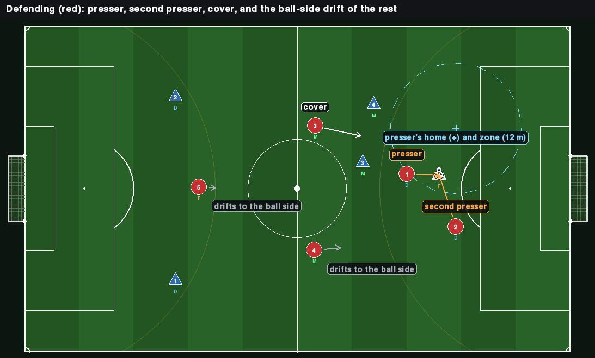

*Blue's forward has the ball in front of red's goal. Red 1 presses because the ball is inside the zone around red 1's home position (dashed circle). Red 2 is close enough to join as second presser. Red 3 covers. Red 4 and 5 shift toward the ball's side.*

### 5.1 Who Goes to the Ball

A player **may press** if the player sees the ball and either of these holds:

- the ball is inside the player's zone: within 12 m (`zone.r_zone`) of the anchor;
- the ball is within 8 m (`zone.engage`) of where the player stands now. This lets a player go straight for a carrier who is right there, instead of walking home first.

Among the players who may press, the one **nearest to the ball** is the presser (ties go to the lower player number). The presser runs at the ball and tackles as soon as the carrier is within tackle range (2 m).

**Double team.** The next-nearest player who sees the ball also goes for it when that player is within 10 m of the ball (`zone.double_dist`). So at most two players press. Setting `double_dist: 0` gives a single presser.

### 5.2 Cover

With `cover.enabled`, the next player after the pressers moves to a point 5 m (`cover.dist`) from the ball on the line toward our own goal, so that someone is goal-side of the presser. That player goes at most 4 m (`cover.max_dev`) from home to do it.

### 5.3 Everyone Else

- A player who sees the ball shifts from home toward the ball by 40% (`zone.omega`) of the distance, counted up to 12 m. So the shift is at most 4.8 m.
- A player who does not see the ball stays at home.

### 5.4 Counter-Press

For 10 steps after the team loses the ball, the 2 nearest players who see it (`moves.counter_press.n`) both go for it, whatever their zones.

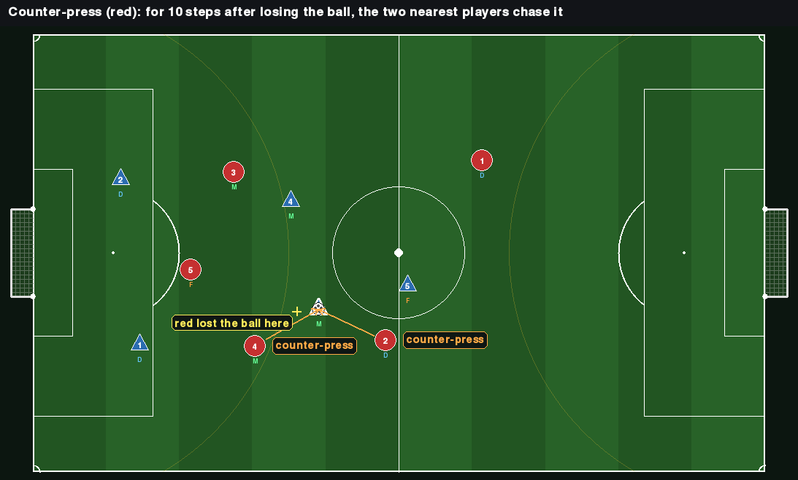

*Red lost the ball at the yellow cross a few steps ago. Red 4 and red 2 both chase it.*

### 5.5 Cutting Passing Lanes (aggressive style only)

`opponent.lanes` is on in the aggressive style and off otherwise. While the other team has the ball, and while its pass is in the air:

1. One player presses the ball as in 5.1.
2. A **lane** runs from the ball to each player the carrier could pass to: every opponent level with or ahead of the ball, and up to 8 m behind it (`lanes.side`). Passes further back are left alone.
3. Each other player may take one lane and stands on it, at `frac` of the way from the ball. With the default 0.5 that is exactly **in the middle between the carrier and the receiver**. A blocker tackles if the carrier runs into range.
4. The most dangerous lane (the receiver nearest our goal) is filled first, by the nearest player who can take it. One player per lane.
5. A player can take a lane only if that player sees the receiver, and only if the point is within `lanes.max_dev` of home: 12 m for defenders, 22 m for the others. The ball position is the team's shared sighting.
6. Lanes come before the second presser and the counter-press, so fewer players chase the ball and more of them block passes.

It works because a carrier only passes along a lane judged safe (Section 6.2), and a player standing in the middle of it makes it unsafe.

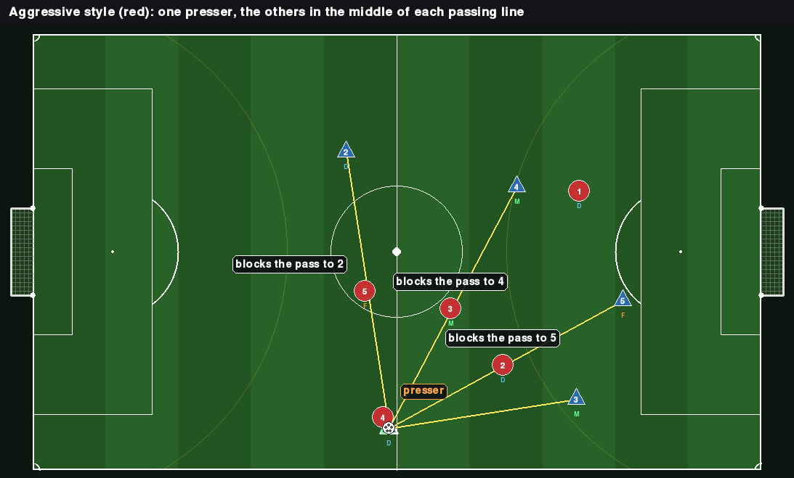

*Aggressive style. A blue defender has the ball. Red 4 presses. Red 5, 3 and 2 each stand in the middle of a yellow passing line. The pass to blue 3 stays open, and red 1 holds position at the back.*

Measured against a normal team, 60 matches each. "Before" is the aggressive style without lane cutting; "now" is the current one.

| The normal team, per match | Before | Now |
|---|---|---|
| Share of time a defender or midfielder on the ball has a safe forward pass | 43% | 30% |
| Shots | 5.1 | 3.7 |
| Forward passes completed | 21.5 | 20.2 |
| Times tackled | 7.7 | 8.1 |
| Goals | 2.3 | 2.3 |

The normal team gets fewer shots but better ones, so its goals did not fall. The aggressive team's players stand 7.5 m from their anchors on average when defending, against 6.7 m without lane cutting, so its formation is a little harder to read.

### 5.6 Loose Ball

The nearest player who sees a loose ball goes to it. If the ball is loose because our own pass is in flight, the others keep supporting (Section 7). Otherwise they defend as above.

### 5.7 Winning the Ball From a Pass (not a decision)

These are rules of the game (`game.md`, Section 8), listed here because they shape how the team defends:

| How | Rule |
|---|---|
| Interception at the kick | When a pass is played, the game checks every defender who is not frozen and has the passer inside their own vision. A defender who can reach the ball's path at most 0.5 steps (`intercept_margin`) after the ball does is the interceptor. The ball flies to that point and `Obs.incoming` sends the defender there |
| Cut-out in flight | On each step of a pass, an opponent within 1.5 m (`flight_cut.radius`) of the stretch the ball covers takes it. The first 3 m of the pass are exempt |
| Tackle | Within 2 m of the carrier. It succeeds with probability `my control / (my control + the carrier's control)`. A failed tackle freezes the tackler for 3 steps |

At most two tackles in a row can succeed (A takes from B, B takes it back); after that tackling is off until the ball is passed, shot or picked up, or 15 steps pass.

---

## 6. The Player on the Ball

### 6.1 Two Distances That Matter

| Name | Meaning | Setting |
|---|---|---|
| **Under threat** | A visible defender is within 6 m: closing in, not yet able to tackle | `carrier.release_dist` |
| **Pressed** | A visible defender is within 3 m | `carrier.press_dist` |

Only defenders inside the carrier's own vision count, here and in everything below.

### 6.2 Which Passes Are Possible

For each of the four teammates the carrier considers a pass to feet and a through ball (6.4), and keeps the better-scoring one that is allowed.

**A pass is allowed** when all of these hold:

- It is no longer than 60 m (`attack.max_pass`), or 45 m when a defender plays it (`roles.d_max_pass`).
- No visible defender could intercept it at the kick, even with 1.5 extra steps in hand (`attack.safe_slack`). The game lets a defender intercept when at most 0.5 steps late; the carrier refuses the pass unless the defender would be more than 2.0 steps late. A pass that is safe by a hair gets intercepted in practice.
- No visible defender stands within 3 m of the ball's path (`flight_cut.radius + attack.lane_margin`), not counting the first 3 m.

**The score** of an allowed pass:

```
score = w_fwd  * forward gain            (metres gained toward goal / pitch length)
      + w_open * openness of the target  (distance to the nearest visible defender, capped at 15 m, / 15)
      - w_dist * pass length / pitch length
      + pass_bias for the receiver's role (defender -0.1, midfielder 0, forward +0.1)
      + hub_bonus   if the receiver is the playmaker            (0.3)
      + through.bonus if it is a through ball                    (0.1)
      + one_two_bonus if the receiver has just passed and is running on  (0.4, see 7.1)
```

with `w_fwd = 2.0`, `w_open = 0.5`, `w_dist = 0.3`.

**Known free.** A teammate is known to be free when the target is inside the carrier's own vision and no visible defender is within 8 m of it (`carrier.free_dist`).

### 6.3 What the Carrier Does

The first rule that applies:

| # | Rule | Details |
|---|---|---|
| 1 | **Set up a better-placed teammate** | An allowed pass to a teammate whose shot chance is at least 0.10 (`carrier.better_margin`) above the carrier's own, and at least the shot bar. Any direction: this is the cross, the cut-back and the square ball |
| 2 | **Shoot** | If within 35 m and the carrier's own estimate of the chance is at least 0.30 (`attack.shoot_min`), or 0.50 for a defender. Exception, **carry it closer**: if the carrier is more than 14 m out (`attack.shoot_close`), not under threat, and no defender blocks the way within 7 m ahead (`attack.shoot_free`), the carrier dribbles on instead of shooting from distance |
| 3 | **Pass forward or square** | The best-scoring allowed pass to a teammate who is not more than 2 m behind the carrier (`carrier.back_tol`), if its score reaches the bar: 0.30 (`attack.pass_min`). With no defender within 10 m ahead and no threat, the bar is higher by `roles.carry_bias` (0.8 for defenders and midfielders, 0 for forwards), so they carry the ball instead of passing at once. Under threat the bar is lower by 0.2 |
| 4 | **Release under threat** | If under threat: pass to the best-scoring teammate known to be free, in any direction |
| 5 | **Clear** | A defender (slot type D) who is pressed, in his own half (`clear.max_x`), with no allowed pass to a teammate known to be free: he kicks the ball long upfield (the `CLEAR` action, game.md Section 7). He aims at the most open of five directions within 40° of straight ahead, leaning toward a teammate who is ahead of the ball (`clear.w_mate`) |
| 6 | **Dribble at goal** | If no visible defender is within 6 m ahead (`attack.d_danger`). A defender does not dribble past 60% of the pitch while a pass is possible |
| 7 | **Back pass when blocked and pressed** | Blocked ahead and pressed: pass to the nearest teammate known to be free, or failing that the most open one |
| 8 | **Carry aside** | Otherwise move 4 m diagonally or sideways, whichever way has the most room. If nowhere has more than 3 m of room, shield the ball and stand |

So a pass backward only happens in three cases: to set up a better shot (rule 1), under threat to a teammate known to be free (rule 4), or blocked and pressed (rule 7).

The carrier's estimate of a shot uses the same formula as the game (`game.md`, Section 8.5) but only the defenders the carrier can see, so the real chance can be lower. A shot from inside the goal area always scores.

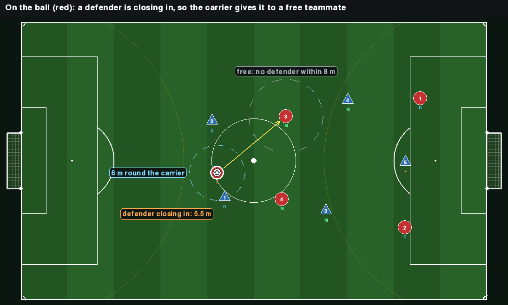

*Rule 4. A blue defender is 5.5 m from the red forward, inside the 6 m circle. The forward passes back to red 3, who has no blue player within 8 m.*

### 6.4 Through Balls

A through ball is played to a point ahead of a teammate instead of to feet. It is only played to a runner **known to be free**:

- The runner is not behind the carrier, and the point is up to 8 m ahead of the runner (`moves.through.lead`): straight up the pitch, or toward the goal once the runner is past 60% of it.
- The runner gets there first: the lead is cut to 80% of what the runner can cover while the ball is in flight.
- The runner and the point are both inside the carrier's vision, and no visible defender is within 8 m of either (`moves.through.space`).
- The pass is allowed as in 6.2.
- No visible defender could reach **any point of the ball's path** in time: for every metre of the path, no defender is within `1.5 m + what they can run while the ball travels there + 0.5 m` (`cut_margin`).

The game plays the ball to the point (the `THROUGH` action), and `Obs.incoming` sends the runner there. The pass event carries `through=True`.

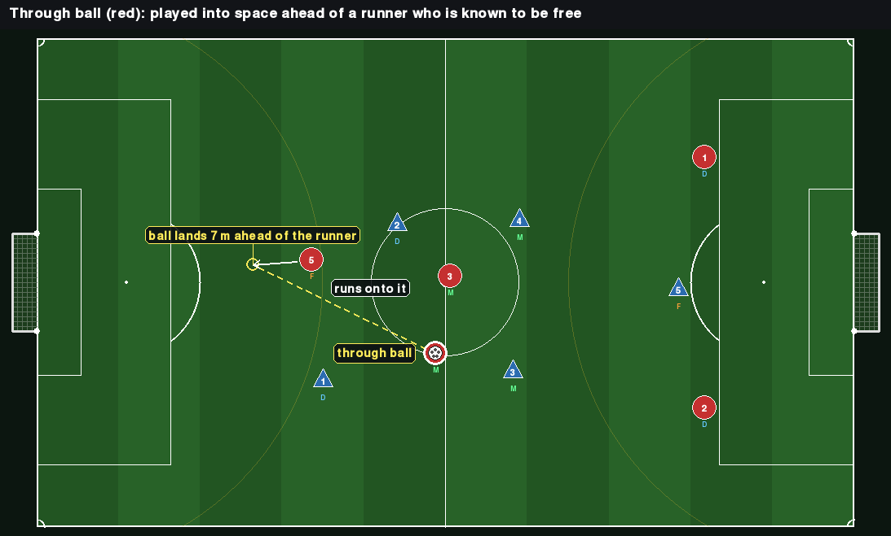

*Red's midfielder plays the ball 7 m ahead of red 5, who runs onto it.*

### 6.5 Patience

`opponent.patience` stops a team from keeping the ball for ever. It is **off** in the normal and aggressive styles and **on** in the defensive style.

The team counts how long it has kept the ball without a break (its own passes in flight included). After `start` steps (60) the **urgency** rises in a straight line and reaches 1 at `full` steps (120). Urgency lowers the shot bar by up to 0.10 and the forward-pass bar by up to 0.2. At 1 the carrier forces the play: no more passes backward, and the carrier runs at the defence instead of moving aside.

Without it a defensive team could keep the ball for most of a match (one spell of 830 steps was measured), because it never commits players forward. With it the longest spell in any pairing of styles is under 185 steps.

---

## 7. Players off the Ball

When a teammate has the ball, each other player takes the first rule that applies. Every target is then nudged toward free space (7.8).

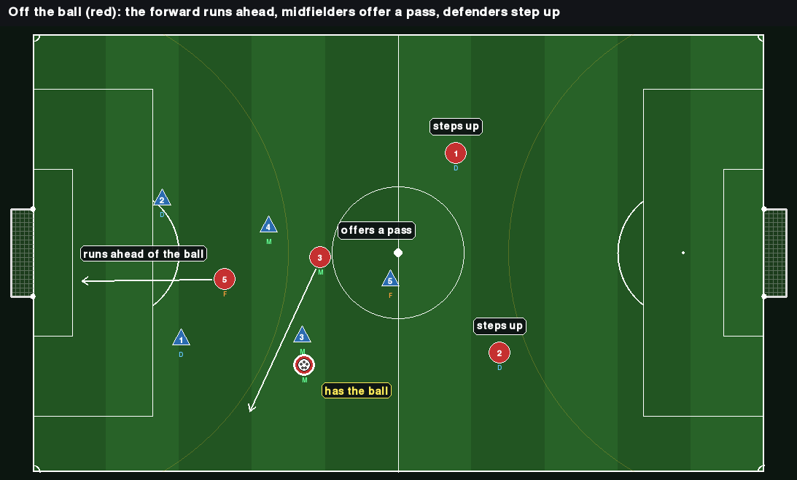

*A red midfielder has the ball. The forward runs ahead of it, the other midfielder moves to offer a pass, and the defenders step up.*

### 7.1 Pass and Move

For 10 steps after passing, the passer keeps running: 12 m straight ahead of wherever the passer is (`moves.pass_move.run`). Teammates get a bonus (0.4) for giving the ball back, which makes a one-two.

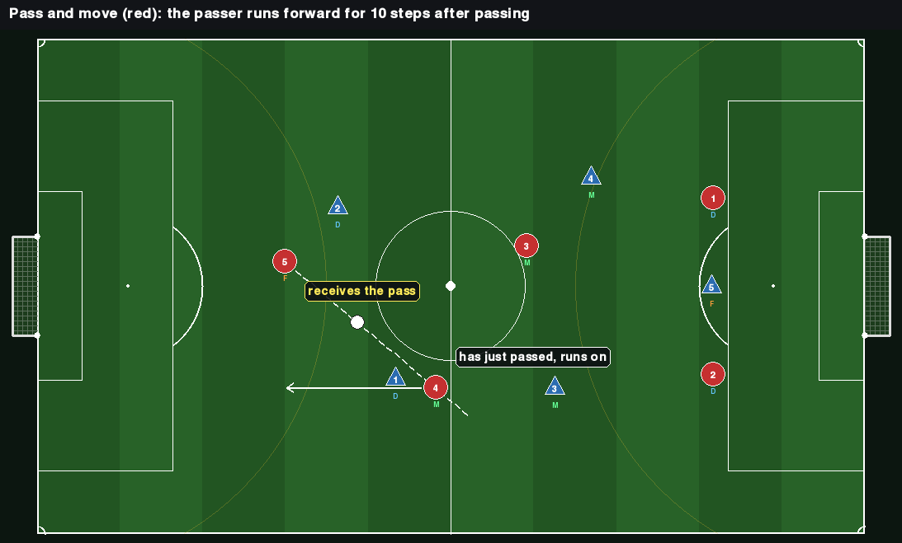

*Red 4 has passed to red 5 (the ball is in the air) and keeps running forward.*

### 7.2 Attacking the Box

When the carrier is past 70% of the pitch and more than 8 m off the centre line (`moves.box`):

- the forward runs to the **far post**: 8 m from the goal line, on the side away from the ball;
- the midfielder on the far side runs to the **cut-back spot**: 18 m from the goal line, in the centre.

Rule 1 of the carrier (6.3) is what then finds them.

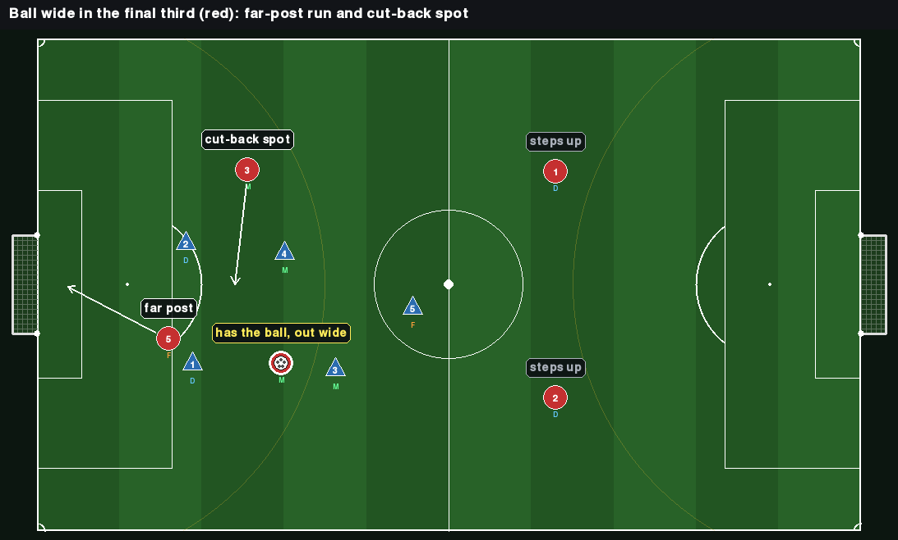

*Red 4 has the ball out wide. Red 5 runs to the far post and red 3 to the cut-back spot.*

### 7.3 Overlap

A midfielder whose home is off-centre runs round the outside of the carrier when all of these hold: the carrier is past 45% of the pitch, the midfielder is behind the carrier and within 12 m (`moves.overlap.trigger`), and the carrier is on the midfielder's side or near the centre. The target is 8 m ahead and 7 m outside the carrier, at most 18 m from home.

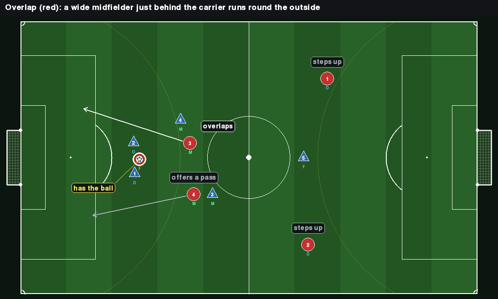

*Red's forward has the ball. Red 3, just behind, runs round the outside.*

### 7.4 Dropping Deep

When the carrier is more than 35 m behind the forward's home (`moves.drop_deep.trigger`), the forward comes 12 m toward the ball to be reachable.

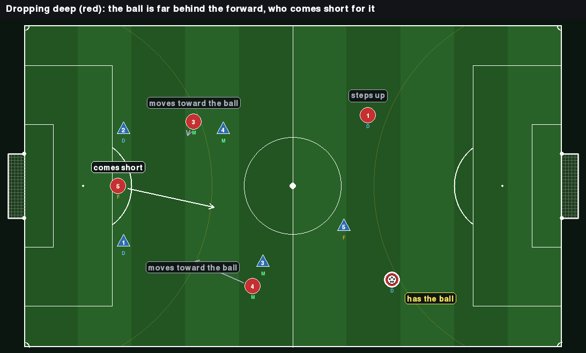

*A red defender has the ball far behind the forward, so red 5 comes short for it.*

### 7.5 The Forward's Run

Otherwise the forward runs ahead of the ball: to at least 10 m beyond the carrier (`run.lead`) and at least 4 m beyond home, stopping 4 m short of the goal line. Of three lanes (straight on, 8 m to either side), the forward takes the one with the most room from visible defenders. The run goes at most 18 m from home (`run.r_run`).

### 7.6 Midfielders and Defenders

- **Midfielder, ball ahead:** offer a pass. Five spots 10 m around the carrier are tried (`support.offer_dist`): behind, to either side, and diagonally ahead on either side. A spot is skipped if a teammate is within 8 m of it and nearer to it, so two players never offer in the same place. Among spots with at least 6 m of room, the most advanced is taken. The midfielder goes at most 30 m from home.
- **Midfielder, ball behind:** move up to 6 m toward the carrier (`support.mid`).
- **Defender:** step 1 m up (`support.def`).

### 7.7 Counter-Attack

For 15 steps after winning the ball: the forward's run aims 16 m beyond the carrier instead of 10 (`lead_mult` 1.6), midfielders make the same run instead of offering a pass, and forward gain counts 1.5 times as much in the pass score (`fwd_mult`).

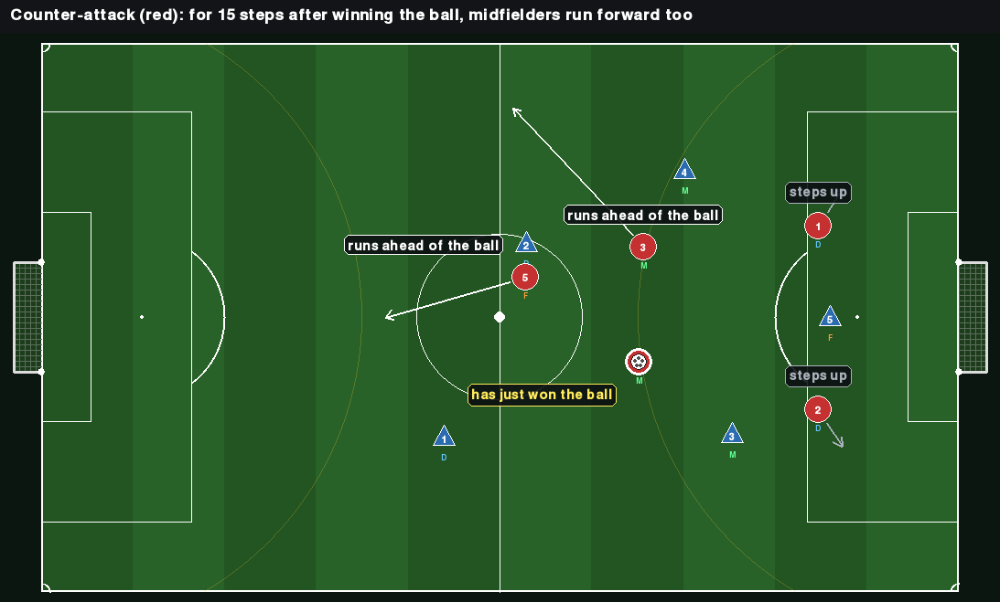

*Red 4 has just won the ball. Both the forward and red 3, a midfielder, run ahead of it.*

### 7.8 Drifting Into Space

Every off-ball target above is moved up to 6 m (`space.radius`) toward space. Of the target and eight points around it, the player takes the one with the highest

```
distance to the nearest visible defender (up to 15 m)
+ 0.5 * distance to the nearest teammate (up to 15 m)        # no bunching
- 0.2 * distance from where the player is now                # keeps it steady
```

`space.radius: 0` turns it off. Defending players are not affected.

Not implemented: an offside line, throw-ins and corners (they need new game rules), third-man runs and decoy runs.

---

## 8. Play Styles (`styles`)

A play style is **how** a team plays, on top of its formation. Three presets ship: `normal`, `aggressive` and `defensive`.

### 8.1 How It Works

`styles.presets.<name>` is a partial copy of the config. For a team playing that style it is merged over the config (`config.apply_style(cfg, name)`), and that team's controller and its attacking and defending shapes read the merged copy. So each team has its own view of the config (`env.team_cfg[team]`), while the rules of the game stay shared.

- A preset may only set `opponent.*` (behaviour) and `formations.phases.*` (shape). Anything else, or a key that does not exist in the config, is rejected when the config is loaded.
- `normal` is empty: it is exactly the values written in `default.yaml`.
- To make a new style, add a preset. No code changes are needed.

### 8.2 Choosing a Style

| Where | How |
|---|---|
| Config | `styles.ours`, `styles.opponent` |
| Per match | `env.reset(our_style=..., opp_style=...)` |
| Mid-match | `env.set_style(team, name)` (positions, timers and the score are kept) |
| Viewer | `--style` (blue), `--opp-style` (red); keys `Z` / `X` switch them during a match |

`info["styles"]` holds the current pair `(ours, opponent)`. Our own style always sets our shape (the anchors); it sets our behaviour only when our team is scripted.

### 8.3 The Three Styles

- **Normal:** the behaviour described in Sections 4 to 7.
- **Aggressive:** a high line and a press that cuts passing lanes (5.5). The nearest player within 18 m always goes to the ball; the others stand in the middle between the carrier and the players the carrier could pass to. More players ahead of the ball, riskier passes.
- **Defensive:** a deep, narrow block that keeps players back even when the team has the ball, and drops quickly when it loses it. It breaks with long balls to its forward and does not keep the ball for long (patience, 6.5). Its players defend with the same zone rules as normal; only where they stand differs.

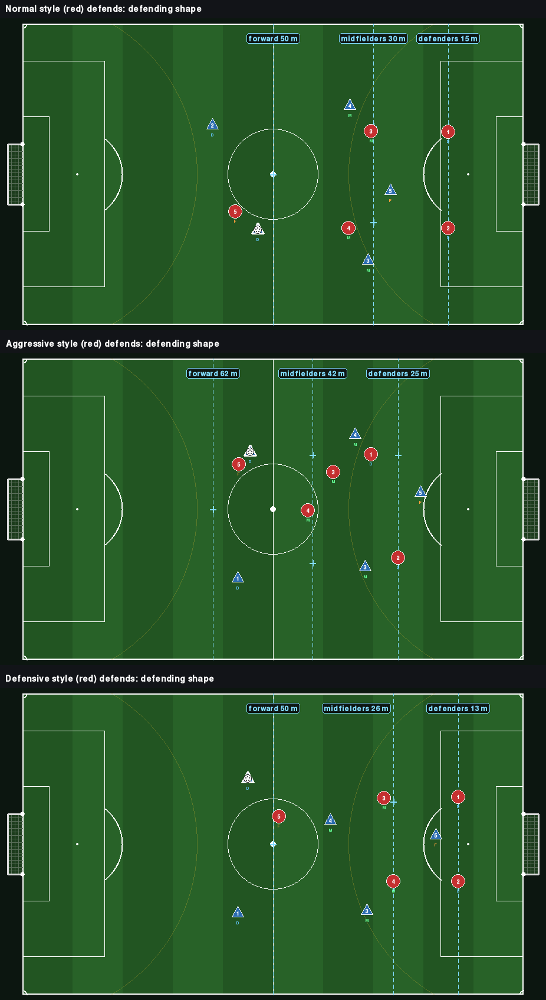

*The same situation in each style: a blue defender has the ball near the halfway line. Normal holds its lines at 15, 30 and 50 m. Aggressive stands 10 m higher, with the forward on the ball and others on the passing lines. Defensive sits deepest and narrowest, with only its forward at halfway.*

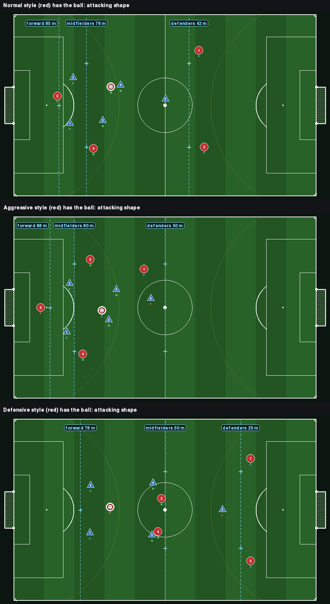

*Red has the ball. Normal pushes its midfielders to 76 m. Aggressive pushes them to 80 m and its defenders to halfway. Defensive keeps its midfielders at halfway and its defenders at 25 m, so only the forward is in the attacking third.*

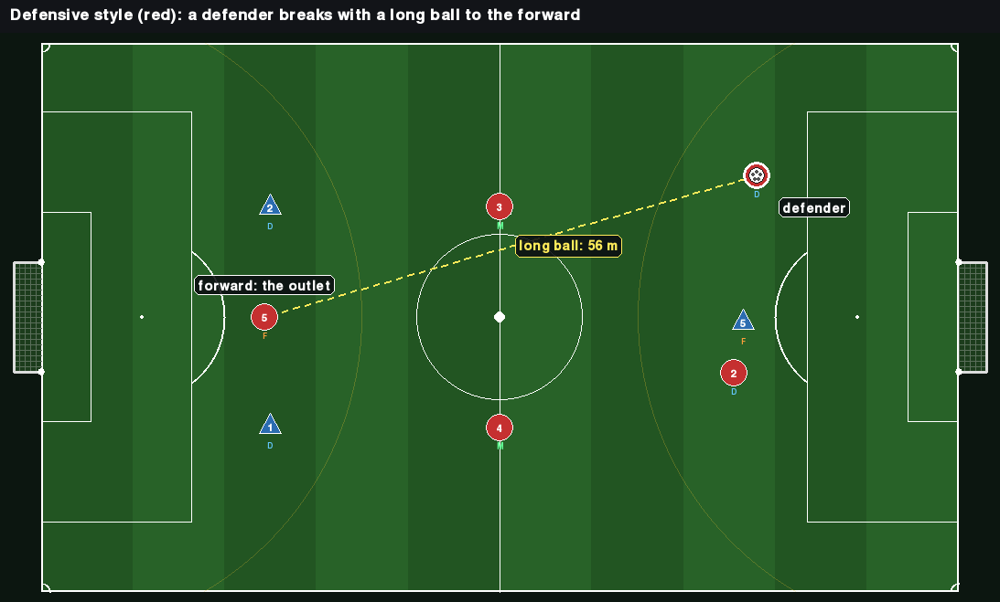

*Defensive style. A defender plays a 56 m ball to the forward. In the other styles a defender may pass at most 45 m.*

### 8.4 What Each Preset Changes

| Setting | normal | aggressive | defensive |
|---|---|---|---|
| Attacking shape, depth of the D / M / F lines (m from own goal) | 42 / 76 / 85 | 50 / 80 / 88 | 25 / 50 / 78 |
| Defending shape, D / M / F | 15 / 30 / 50 | 25 / 42 / 62 | 13 / 26 / 50 |
| Width, attack / defend | 115% / 80% | 120% / 90% | 105% / 70% |
| Shape change per step (`phases.rate`) | 0.05 | 0.05 | 0.08 |
| Pressing: `r_zone` / `engage` / `double_dist` (m) | 12 / 8 / 10 | 15 / 18 / 12 | as normal |
| Cutting passing lanes (5.5) | off | on | off |
| Pass risk: `safe_slack`, `lane_margin` | 1.5, 1.5 | 1.2, 1.2 | as normal |
| Forward passing: `w_fwd` / `pass_min` | 2.0 / 0.30 | 2.4 / 0.25 | as normal |
| Through ball: room needed (m) | 8 | 6.5 | as normal |
| Players forward: `support.adv` / `def`, `run.lead` / `r_run` (m) | 4 / 1, 10 / 18 | 8 / 4, 13 / 22 | as normal |
| Counter-attack: steps / `lead_mult` / `fwd_mult` | 15 / 1.6 / 1.5 | as normal | 25 / 1.8 / 1.8 |
| Longest pass by a defender (m) | 45 | 45 | 60 |
| Patience (6.5) | off | off | on |

### 8.5 Measured Results

40 seeds per cell, both teams scripted, 1,200 steps, formation 2-2-1. Each pairing pools both sides (80 matches).

| Pairing | Wins – draws – losses (first team) | Goals per match (first – second) |
|---|---|---|
| aggressive vs normal | 32 – 17 – 31 | 2.5 – 2.2 |
| defensive vs normal | 40 – 29 – 11 | 1.2 – 0.6 |
| aggressive vs defensive | 47 – 10 – 23 | 1.9 – 1.3 |
| aggressive vs aggressive | – | 6.8 in total |
| normal vs normal | – | 3.8 in total |
| defensive vs defensive | 20 of 40 drawn | 1.1 in total |

Each style against a normal opponent, per match:

| | aggressive | normal | defensive |
|---|---|---|---|
| Goals for / against | 2.5 / 2.2 | 1.9 / 1.9 | 1.2 / 0.6 |
| Shots for / against | 5.3 / 3.8 | 4.1 / 4.1 | 3.0 / 1.2 |
| Passes (completed) | 42 (87%) | 39 (90%) | 32 (95%) |
| Through balls | 8.2 | 5.7 | 7.5 |
| Tackle attempts | 17.0 | 13.7 | 12.3 |
| Average position when defending (m from own goal) | 47 | 44 | 37 |
| Two deepest players when defending (m from own goal) | 30 | 28 | 20 |

No style beats both others. Aggressive is level with normal and beats defensive about two to one, because its press cuts off the long balls the defensive team relies on. Defensive beats normal: normal sends its midfield high (attacking M line at 76 m), which a team that sits back and breaks can punish. Normal is the weakest overall. Re-measure with `python -m scripts.phase0_checks --styles` after changing a preset.

---

## 9. Formations and Switching

### 9.1 Choosing the Formation

All five formations of `formations.anchors` (`game.md`, Section 4) can be played by either scripted team. The switching mode only decides whether the team changes formation by itself.

| Where | How |
|---|---|
| Config | `formations.ours`, `formations.opponent` (default `"2-2-1"` for both) |
| Per match | `env.reset(our_formation=..., opp_formation=...)` |
| Mid-match | `env.set_formation(team, name)`: same as a switch by the manager (9.3, steps 2 to 5), and the dwell timer restarts |
| Viewer | `--formation` (blue), `--opp-formation` (red); keys `N` / `M` go to the next one during a match |

### 9.2 Switching Modes (`opponent/formation_manager.py`)

Set via `opponent.switching.mode`. The minimum time between two switches is `dwell_min = 150` steps.

| Mode | Rule |
|---|---|
| `NONE` | Formation never changes (default; used in Q1, Q3) |
| `SCHEDULED` | Switch once at step `t_switch` (default 600) to `target` (default `"1-2-2"`) |
| `RANDOM` | After `dwell_min`, switch each step with probability `h_switch` (default 0.005) to a random other formation |
| `SCORE_REACTIVE` | Every `check_interval` (50) steps: if trailing by `trail_thresh` (1) or more, switch to `f_att` (`"1-2-2"`); if leading by `lead_thresh` (1) or more, switch to `f_def` (`"3-1-1"`); otherwise stay |

The manager keeps `formation` (the current name) and `dwell` (steps since the last switch; it starts very large so the first switch is never blocked). Our side, when scripted, never switches by itself.

### 9.3 What Happens at a Switch

1. `FormationManager.update()` returns the new formation name.
2. `ScriptedTeam` sets `in_transition = True`.
3. Players **walk** to their new anchors at normal speed. No teleporting. A player who is not within 1 m of the new anchor and does not have the ball does nothing else (rule 2 in Section 3).
4. The transition ends when all players are within `eps_arrive = 1.0` m of their anchors, or after `transition_max = 60` steps.
5. A switch event is logged: `{t, type="switch", team, from_, to}`.

During the transition the players are far from their new anchors, so their control rating is low. That is the natural cost of switching, and the visible signal our team can detect.

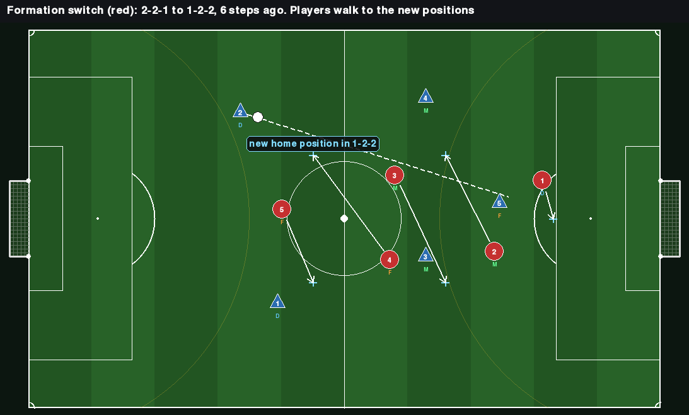

*Six steps after red switched from 2-2-1 to 1-2-2. Each arrow goes from a red player to that player's new home position (cross). The letters already show the new roles.*

---

## 10. The Playmaker Variant (Q3)

When `sigma > 0`, the opponent player with number `sigma` is the playmaker.

| Aspect | Normal player | Playmaker |
|---|---|---|
| Vision radius | 25 m | Unlimited |
| Ball-side shift | Only when the ball is inside the radius | Always (the ball is always visible) |
| Pass safety check | Only visible defenders | All defenders |
| Interception at the kick | Only if the passer is inside the radius | Every pass |
| Hub bonus | None | Teammates add `hub_bonus = 0.3` to the pass score when passing to the playmaker |

Everything else (anchor, zone, speed, control rating) is identical. The advantage is **information only**. The viewer draws the playmaker with a gold ring.

---

## 11. Config Reference

Everything below is under `opponent.` in `default.yaml` unless it says otherwise. "Off" means the value that switches the behaviour off.

**Defending**

| Key | Default | Meaning |
|---|---|---|
| `zone.r_zone` | 12.0 | Radius of a player's zone around the anchor (m) |
| `zone.engage` | 8.0 | A player may also press a ball this close to where the player stands (m) |
| `zone.double_dist` | 10.0 | The second presser joins when this close to the ball (m). Off: 0 |
| `zone.omega` | 0.4 | Share of the way a non-pressing player shifts toward the ball |
| `cover.enabled`, `dist`, `max_dev` | true, 5.0, 4.0 | Cover: how far goal-side of the ball, and how far from home at most (m) |
| `width.slide`, `slide_rate` | 3.0, 0.3 | Sideways slide of the team toward the ball's side (m, m per step) |
| `moves.counter_press.steps`, `n` | 10, 2 | Counter-press: for how long, and how many players. Off: steps 0 |
| `lanes.enabled` | false | Cutting passing lanes (5.5) |
| `lanes.frac` | 0.5 | Where on the lane to stand (0.5 = the middle) |
| `lanes.side` | 8.0 | Receivers up to this far behind the ball still count (m) |
| `lanes.max_dev` | D 12, M 22, F 22 | How far from home a player may go to block a lane (m) |

**On the ball**

| Key | Default | Meaning |
|---|---|---|
| `attack.shoot_min` | 0.3 | Shot bar: the carrier's estimated chance must reach it |
| `roles.d_shoot_extra` | 0.2 | Added to the shot bar for defenders |
| `attack.shoot_close`, `shoot_free` | 14.0, 7.0 | Carry closer instead of shooting when further out than `shoot_close` with nobody blocking within `shoot_free` ahead (m) |
| `attack.w_fwd`, `w_open`, `w_dist` | 2.0, 0.5, 0.3 | Weights of the pass score |
| `attack.pass_min` | 0.3 | Bar for a forward or square pass |
| `attack.open_max` | 15.0 | Cap on distances used as "room" (m) |
| `attack.fwd_cap` | 1.0 | Cap on the forward-gain term (1.0 = no cap) |
| `attack.hub_bonus` | 0.3 | Pass-score bonus for passing to the playmaker |
| `attack.safe_slack` | 1.5 | Extra steps a defender must be late before a pass counts as safe |
| `attack.lane_margin` | 1.5 | Extra clearance from defenders along the ball's path (m) |
| `attack.max_pass`, `roles.d_max_pass` | 60.0, 45.0 | Longest pass, for anyone and for defenders (m) |
| `attack.d_danger` | 6.0 | A defender this close ahead blocks the dribble (m) |
| `roles.d_dribble_max_x` | 0.6 | Defenders do not dribble past this share of the pitch when a pass is possible |
| `roles.carry_bias` | D 0.8, M 0.8, F 0 | Raise of the pass bar when there is room to carry |
| `roles.pass_bias` | D -0.1, M 0, F 0.1 | Pass-score bonus by the receiver's role |
| `carrier.press_dist`, `release_dist` | 3.0, 6.0 | "Pressed" and "under threat" (m) |
| `carrier.press_relief` | 0.2 | Lowering of the pass bar under threat |
| `carrier.release_shoot` | 0.0 | Lowering of the shot bar under threat |
| `carrier.better_margin` | 0.1 | How much better a teammate's shot must be to get the ball |
| `carrier.back_tol` | 2.0 | A receiver up to this far behind still counts as "square" (m) |
| `carrier.free_dist` | 8.0 | "Known free": no visible defender this close (m) |
| `carrier.carry_free`, `carry_step` | 10.0, 4.0 | Room ahead needed for the carry bias; length of a step aside (m) |
| `clear.enabled`, `max_x`, `w_mate` | true, 0.5, 0.5 | Clearance by a pressed defender: on/off, how far up the pitch it is allowed, pull of the aim toward a teammate ahead |
| `moves.assist.enabled` | true | Rule 1 also applies when the carrier cannot shoot |
| `moves.through.enabled`, `lead`, `space`, `bonus`, `cut_margin` | true, 8.0, 8.0, 0.1, 0.5 | Through ball (6.4) |
| `patience.enabled`, `start`, `full`, `shoot`, `pass_relief` | false, 60, 120, 0.1, 0.2 | Patience (6.5) |

**Off the ball**

| Key | Default | Meaning |
|---|---|---|
| `support.adv`, `mid`, `def` | 4.0, 6.0, 1.0 | Basic step of a forward, a midfielder, a defender (m) |
| `support.r_support` | 10.0 | Cap on that basic step (m) |
| `support.offer_dist`, `offer_max`, `offer_sep`, `offer_space` | 10.0, 30.0, 8.0, 6.0 | Offering a pass (7.6). Off: `offer_dist` 0 |
| `run.enabled`, `lead`, `r_run`, `dy`, `goal_gap` | true, 10.0, 18.0, 8.0, 4.0 | The forward's run (7.5) |
| `moves.pass_move.steps`, `run`, `one_two_bonus` | 10, 12.0, 0.4 | Pass and move (7.1). Off: steps 0 |
| `moves.box.x`, `wide`, `post_gap`, `cutback_gap` | 0.7, 8.0, 8.0, 18.0 | Attacking the box (7.2) |
| `moves.overlap.trigger`, `ahead`, `wide`, `max_dev` | 12.0, 8.0, 7.0, 18.0 | Overlap (7.3). Off: trigger 0 |
| `moves.drop_deep.trigger`, `dist` | 35.0, 12.0 | Dropping deep (7.4). Off: dist 0 |
| `moves.counter.steps`, `lead_mult`, `fwd_mult` | 15, 1.6, 1.5 | Counter-attack (7.7). Off: steps 0 |
| `space.radius`, `w_mates`, `w_move` | 6.0, 0.5, 0.2 | Drifting into space (7.8). Off: radius 0 |

**Shape, style and the rest**

| Key | Default | Meaning |
|---|---|---|
| `formations.phases.enabled`, `rate` | true, 0.05 | Attacking and defending shapes (4.2) |
| `formations.phases.attack` | D 0.42, M 0.76, F 0.85, width 1.15 | Depth of each line (share of the pitch) and width scale |
| `formations.phases.defend` | D 0.15, M 0.30, F 0.50, width 0.80 | The same for the defending shape |
| `styles.ours`, `styles.opponent` | normal | Play style of each team (Section 8) |
| `styles.presets` | normal, aggressive, defensive | The presets |
| `switching.*` | mode NONE | Formation switching (9.2) |
| `zone.eps_arrive`, `transition_max` | 1.0, 60 | End of a formation transition (9.3) |
| `playmaker.sigma` | 0 | Playmaker's player number, 0 = none (Section 10) |
| `randomness.eps_opp` | 0.0 | Probability of a random action |
| `block.*`, `width.attack`, `width.defend`, `roles.push_scale`, `roles.drop_scale` | 0 (off) | Older whole-team shifts, replaced by the shapes |

---

## 12. Code Reference

| File | Role |
|---|---|
| `opponent/controller.py` | `ScriptedTeam`: all the decisions in this document |
| `opponent/formation_manager.py` | `FormationManager`: when to switch formation |
| `football/config.py` | `apply_style`: a team's view of the config in its play style |
| `football/formations.py` | Anchors, attacking and defending shapes |
| `scripts/doc_screenshots.py` | Makes the pictures in this document |

Where each behaviour lives in `controller.py`:

| Method | Section |
|---|---|
| `act`, `_update_timers` | 3 (team step) |
| `_decide` | 3 (player step) |
| `_team_context`, `_assign_lanes`, `_zonal`, `_loose_ball` | 5 |
| `_attack_with_ball`, `_pass_candidates`, `_lane_safe`, `_through_point`, `_path_uncuttable`, `_carry_aside`, `_urgency` | 6 |
| `_support`, `_run_target`, `_offer_target`, `_free_spot` | 7 |
| `set_cfg` | 8 (loads a style) |
| `update_formation`, `set_formation` | 9 |

How the environment calls it:

```python
# Inside FootballEnv.reset():
self.team_cfg = [apply_style(cfg, s) for s in self.style]     # each team's view of the config (its play style)
self.controllers[1] = ScriptedTeam(self.team_cfg[1], rng, team=1, formation=..., playmaker=sigma_idx)

# Inside FootballEnv.step():
raw[1] = self.controllers[1].act(self.t, obs[1])  # obs[1] is dict {i: Obs}
new_f = self.controllers[1].update_formation(self.t, score[1], score[0])
```

`update_formation()` must be called **after** the step resolves goals, so the score it sees is already updated.

Driving our team with the scripted controller:

```python
env = FootballEnv(cfg, scripted_ours=True)
# Both teams are scripted. Used by the Phase 0 checks and the pictures.
obs, info = env.reset(seed=42, our_style="normal", opp_style="aggressive")
while not env.done:
    obs, r, done, info = env.step()  # no our_actions needed
```

---

## 13. Logging

All events are appended to `env.event_log` and returned in `info["events"]` each step.

| Event type | Fields | Used for |
|---|---|---|
| `"pass"` | passer, receiver, predicted, through | Behaviour stats, Q3 analysis |
| `"pass_result"` | passer, result (`completed` / `intercepted` / `loose`), by | Completion and interception rates |
| `"tackle"` | by, from_, success | Behaviour stats |
| `"shot"` | by, p, scored | Behaviour stats |
| `"goal"` | team, score | Score tracking |
| `"goal_kick"` | by | Restart after a missed shot |
| `"clear"` | by | Clearances (also counted in `env.stats["clearances"]`) |
| `"pickup"` | by | Loose ball analysis |
| `"switch"` | team, from_, to, t | Detection delay (Q2) |

`info` also carries `g` and `f` (the opponent's and our formation), `styles` (our and the opponent's play style) and `sigma`. Stats accumulated per match are in `env.stats` (passes, completions, tackles, shots, goals, possession steps, shadow steps and more). `env.opp_anchor_dist` tracks the opponent's mean distance from its anchors each step, for the readability check.

---

## 14. Phase 0 Checks

Run `python -m scripts.phase0_checks --episodes 100` from `football_adapt/`. All must pass before training.

| Check | Method | Pass condition |
|---|---|---|
| A. Random loses | Random agent vs the scripted team | Score of random ≤ 0.2 |
| B. Balance | Scripted vs scripted | Score of team 0 between 0.35 and 0.65 |
| C. Vision matters | Scripted with radius 10 m vs scripted with the full radius | Score of the small-radius team < 0.4 |
| D. Playmaker works | Scripted with a playmaker vs scripted without | Score of the playmaker team > 0.55 |
| E. Formation readability | Mean distance of the opponent from its anchors, against the mean distance between formations | Excursion < half the separation |
| F. Determinism | Same seed and config, two runs | Identical event logs |

Options: `--matrix` prints the formation win matrix, `--styles` the play-style win matrix, `--T` shortens the matches.

Results on 2026-10-07, with everything in this document in place and both teams in the normal style:

| Check | 20 episodes | Note |
|---|---|---|
| A | 0.00, pass | |
| B | 0.47, pass | Over 600 further matches team 0 won 252 and team 1 won 225: no side advantage |
| C | 0.00, pass | |
| D | 0.47, **fail** | 20 episodes are too few for this check. Over 120 matches the playmaker team scores 0.68 ± 0.04, which passes |
| E | excursion 6.1 m, separation 16.8 m, pass | The excursion was 3.0 m before the realism changes |
| F | pass | |

**Calibration order** if checks fail: zone settings (`r_zone`, `omega`) first, then the attack settings, then support, then the playmaker (`hub_bonus`). Two matches with the same settings can differ by a goal or more, so compare settings over 40 or more seeds.

---

## 15. Common Mistakes

- **Man-marking by accident:** a target must be a point defined by the anchor and the ball, never by one of the other team's player positions. The only exception is lane cutting (5.5), on in the aggressive style only.
- **Using the true ball position when the ball is not visible:** a player who does not see the ball holds the home position. Only the shared sighting of 5.5 and the sideways slide may use a ball the player does not see.
- **Several pressers at once:** the roles are decided once per step in `_team_context()`, before any player decides.
- **A scripted player seeing more than its radius:** always use `o.opp_visible[k]` to gate what a player knows about the other team.
- **Instant formation switches:** players walk to new anchors. The environment moves the anchors, not the players.
- **Mixing random streams:** `ScriptedTeam` takes its own `rng`, seeded independently from the environment and the policy.
- **Hardcoding constants:** always read from `cfg.*`. Each team reads its own view of the config (its play style), so do not read from a global config inside the controller.
- **Judging a change from a few matches:** see the note on noise in Section 14.

---

## 16. The Pictures

The pictures are made by `football_adapt/scripts/doc_screenshots.py`. Each one plays scripted matches with fixed seeds, looks for a step where the behaviour happens, and draws that step with the viewer's own drawing code plus arrows and labels for what the players decided. Nothing is staged: the positions are the ones the players saw on that step.

```bash
cd football_adapt
python -m scripts.doc_screenshots                        # all pictures, a few minutes
python -m scripts.doc_screenshots --only lanes,pressing  # some of them
```

It needs `pygame` and opens no window. Run it again after changing the scripted team, so the pictures match the behaviour. The match is deterministic, so the same code gives the same pictures.
